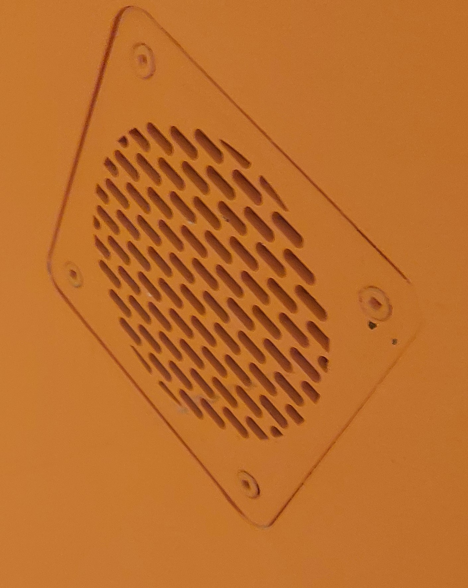

# <ins>Humain</ins>

## Centre des Sciences de Montréal

*Image prise devant l'entrée du centre des sciences de Montréal*

Exposition intérieure et permanente visitée le 30 Janvier 2025.

# <ins>Le Temps de réagir</ins>

Dispositif créé par la Fondation du Centre des Sciences de Montréal en 2015.

Le dispositif présente un capteur de mouvement qui diffuse la silhouette de l'utilisateur dessus un écran avec un but de soccer. L'utilisateur doit alors bloquer des ballons de soccer en déplaçant son corps. Cependant, il y a un décalage intentionnel entre les mouvements de l'utilisateur et le mouvement de sa silhouette. Plus le dispositif avance, plus le décalage est réduit alors que l'avatar de l'utilisateur "vieillit".

Le dispositif, un support pédagogique, est interactif.

Le dispositif se trouve sur le mur extérieur dans le couloir principal de l'exposition. Il occupe environ la moitié de la largeur du couloir.

## Matériel du dispositif
Le dispositif fonctionne grâce aux composantes suivantes : 
- Capteur de mouvement

- Ecran pour diffuser le dispositif

- Speaker

- Tapis pour le positionnement de l'utilisateur

- Boitier du dispositif

Le dispositif ne contient pas de matériel autre fournis par le musée.

## Appréciation du dispositif
