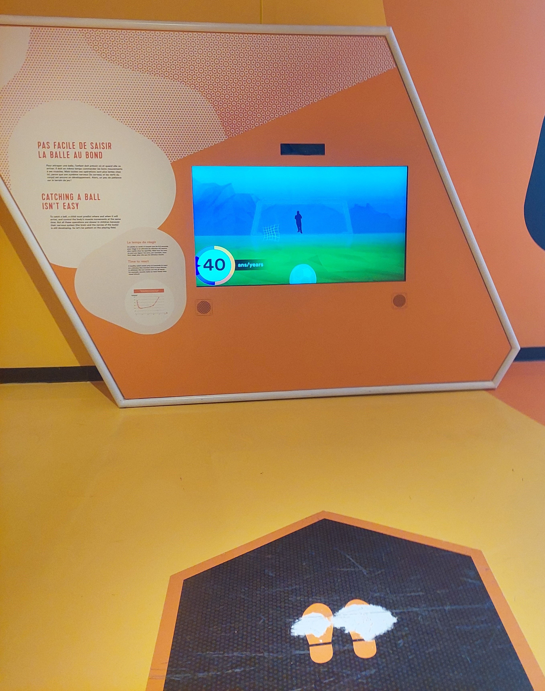
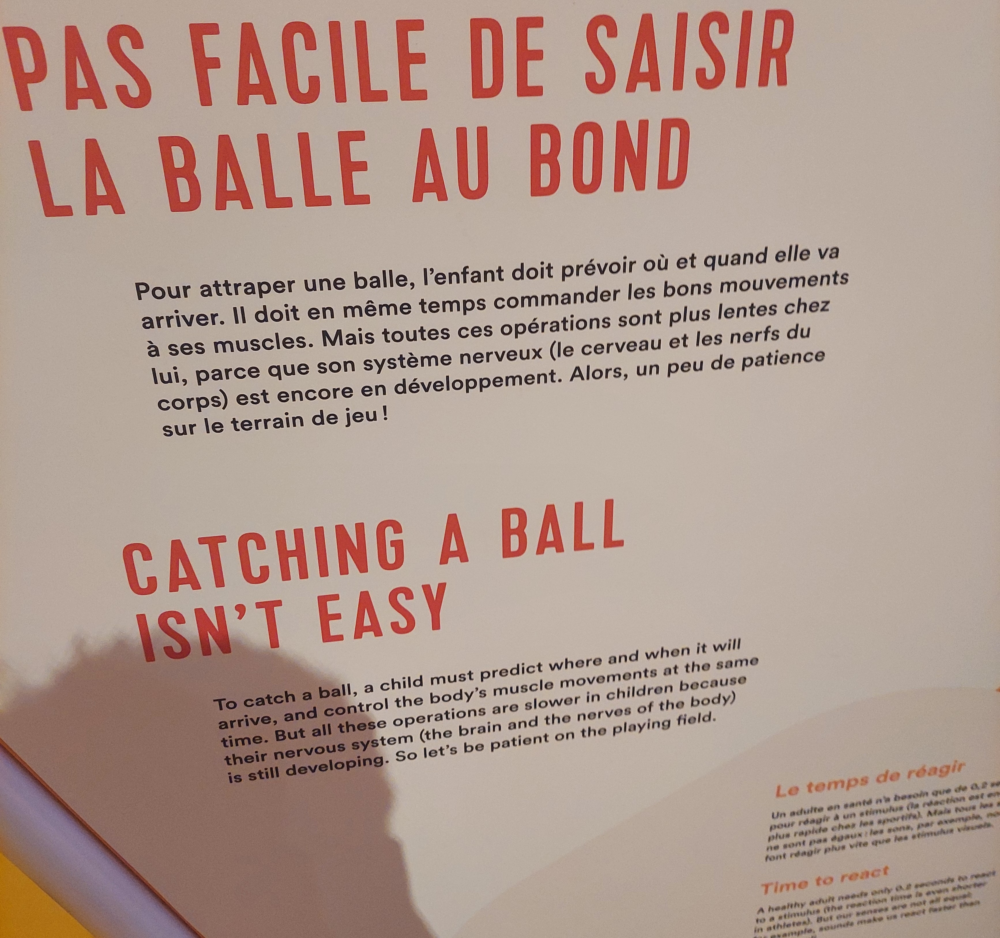
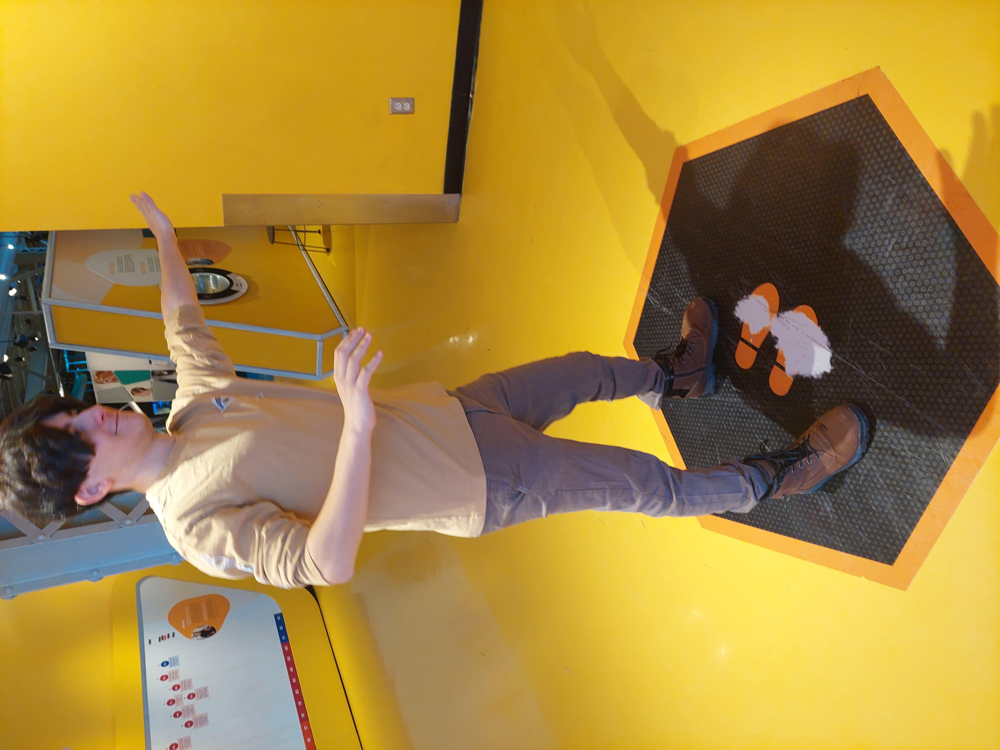
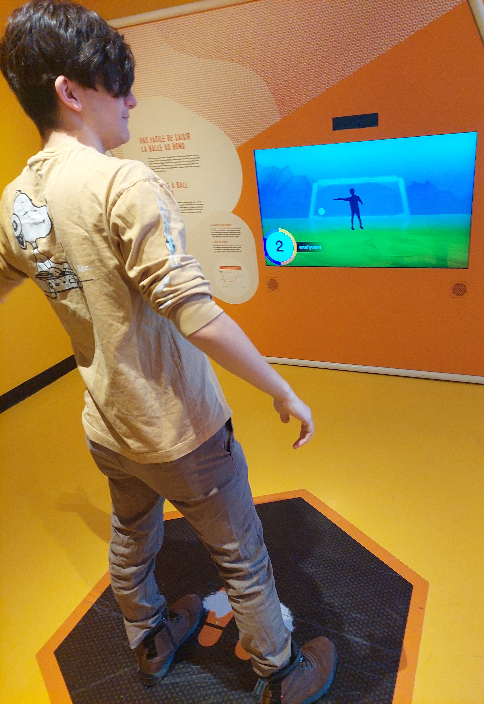
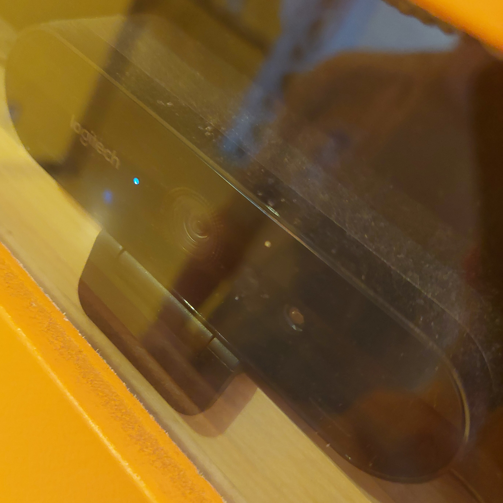
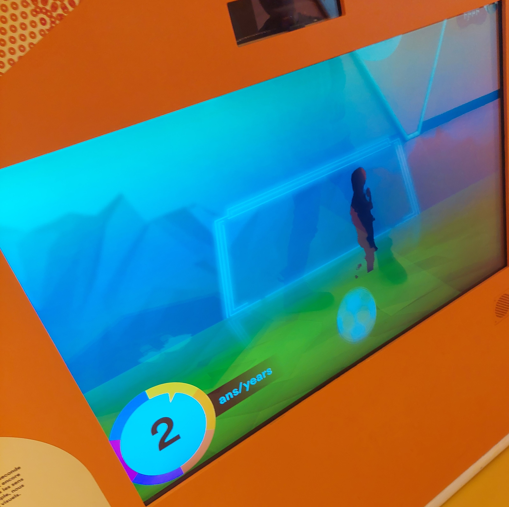
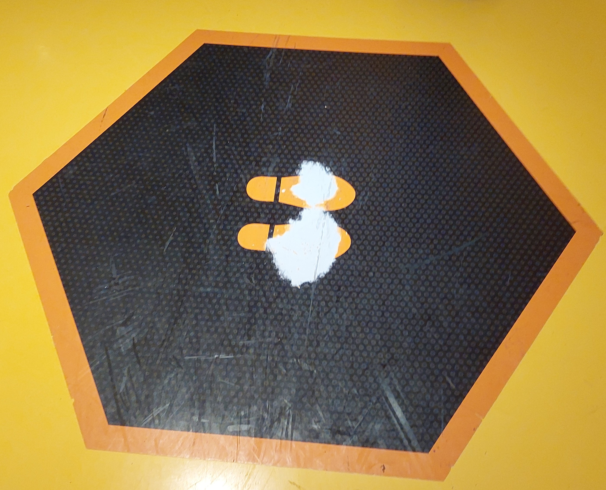

# <ins>Humain</ins>

## Centre des Sciences de Montréal

*Image prise devant l'entrée du centre des sciences de Montréal*

Exposition intérieure et permanente visitée le 30 Janvier 2025.

# <ins>Le Temps de réagir</ins>

*<ins>Le Temps de Réagir</ins>, expositon <ins>Humain</ins>, Centre des Sciences de Montréal*

Dispositif créé par la Fondation du Centre des Sciences de Montréal en 2015.

*Description du dispositif*

Le dispositif présente un capteur de mouvement qui diffuse la silhouette de l'utilisateur (qui est placé sur un tapis) dessus un écran avec un but de soccer. L'utilisateur doit alors bloquer des ballons de soccer en déplaçant son corps (Le dispositif réagit en accord à si la silhouette a touché ou non au ballon). Cependant, il y a un décalage intentionnel entre les mouvements de l'utilisateur et le mouvement de sa silhouette. Plus le dispositif avance, plus le décalage est réduit alors que l'avatar de l'utilisateur vieillit virtuellement.

*Image de Tristan Guilbault, documenteur multimédia indépendant (alias mon grand frère) jouant au dispositif <ins>Le Temps de Réagir</ins>*

Le dispositif, un support pédagogique, est interactif.

*Image de la vue d'ensemble du dispositif*

Le dispositif se trouve sur le mur extérieur dans le couloir principal de l'exposition. Il occupe environ la moitié de la largeur du couloir.

## Matériel du dispositif
Le dispositif fonctionne grâce aux composantes suivantes : 
- Capteur de mouvement pour détecter l'utilisateur

*Image du capteur de mouvement*

- Ecran pour diffuser le dispositif

*Image d'un écran*

- Tapis pour le positionnement de l'utilisateur

*Image du tapis positionnement de l'utilisateur*

- Boitier du dispositif pour contenir la majorité des composantes.

Le dispositif ne contient pas de matériel autre fournis par le musée.

## Appréciation du dispositif
Le dispositif a été d'abord enrageant. Je n'avais pas lu au préalable la description du dispositif (comme le public ciblé, beaucoup plus jeune, aurait sûrement fait), je n'avais donc pas réalisé l'intérêt du dispositif ni la volonté derrière le décalage entre les mouvement de l'utilisateur et de la silhouette. L'enragement a fait place à une satisfaction lorsque j'ai réalisé l'intérêt du décalage en question.

Ce qu'il m'a plu, voire inspiré, de ce dispositif est la manière dont il intègre l'anatomie humaine dans son jeu pour un apprentissage efficace. Dans ce cas, il utilise le décalage entre le cerveau et les muscles d'un enfant montré par le fameux décalage entre les mouvements de l'utilisateur et ceux de son avatar. Ceci me fait penser du potentiel d'utiliser une partie de l'anatomie humaine, ou la psychologie, pour immerser un joueur dans un jeu vidéo ou une installation interactive, entre autres.

Ce qu'il m'a déplu (et que j'aurais voulu améliorer) est l'esthétique de l'installation. Je comprend parfaitement qu'il ne s'agit qu'un dispositif sur plusieurs. Cependant, je trouve que l'image est... très vide pour un dispositif ciblé à un public plus jeune. J'aurais mis plus d'éléments de fond et plus coloré, en m'assurant de ne pas enlever d'attention sur le but ou le ballon. Ceci permettrait sûrement aux enfants d'être plus attirés vers l'attraction et de la conserver en mémoire plus longtemps, amplifiant la diffusion du message du dispositif.

[Site du Centre des Sciences de Montréal](https://www.googleadservices.com/pagead/aclk?sa=L&ai=DChcSEwjh9Obn97KLAxUeYEcBHWRxJY8YABAAGgJxdQ&ae=2&co=1&gclid=Cj0KCQiA-5a9BhCBARIsACwMkJ5rxFipudPAHi6vbXw86fXZqV2oRTKTk2Y35XHmwokjbj_MCgWfaZoaAh9nEALw_wcB&ohost=www.google.com&cid=CAESVeD2tSrNBVqXaHkhqeAYf17MEwNoTn43T5s2TFoSW-VXp7-nQVjNwLz71bnglRcXEyN6UiLCSbWEjsnFnQuhRMdi3fXitaW4F-dUEspeqB6gXsjACDM&sig=AOD64_2Azj-R_gqfCaLjsnC907iS5beE3A&q&adurl&ved=2ahUKEwinr-Dn97KLAxXHEFkFHbmyIYkQ0Qx6BAgWEAQ)
