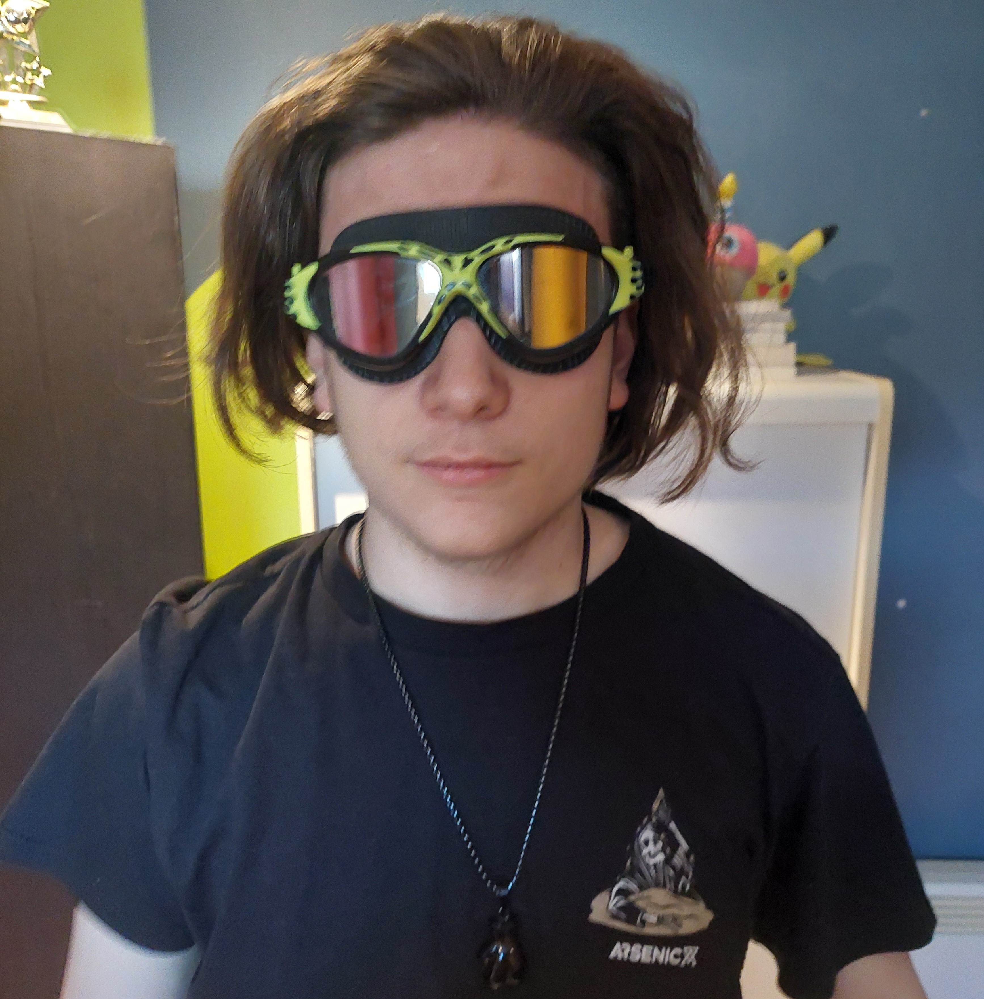
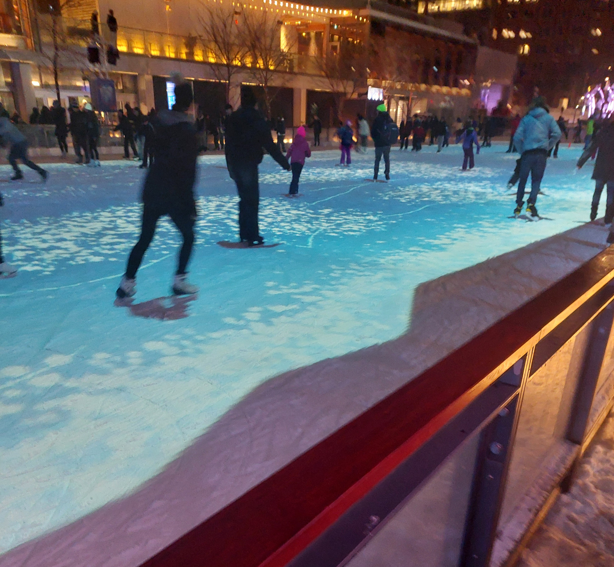
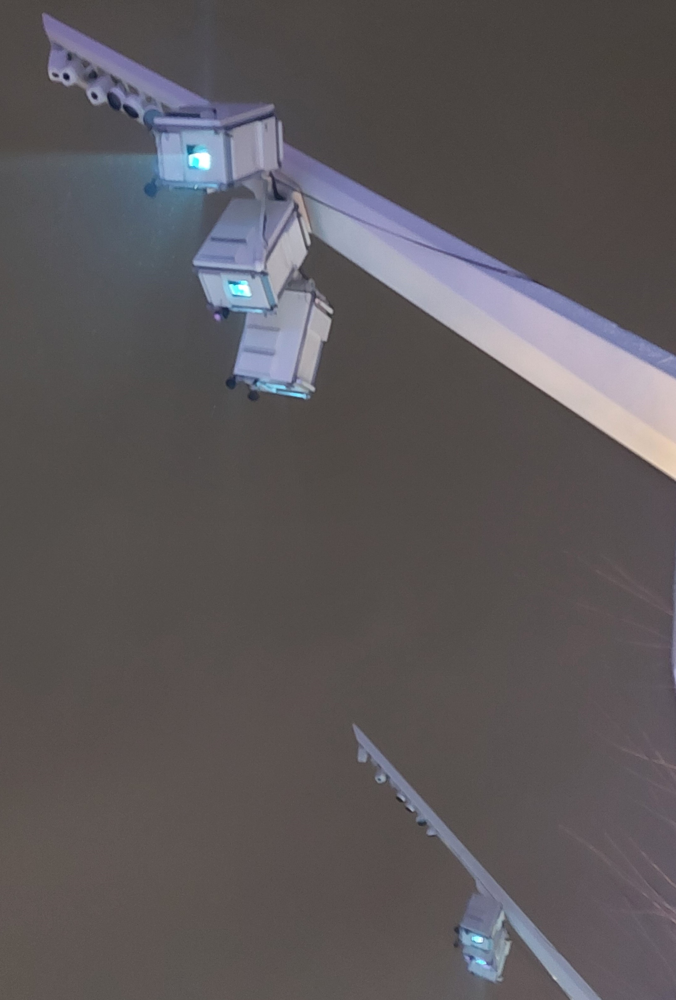
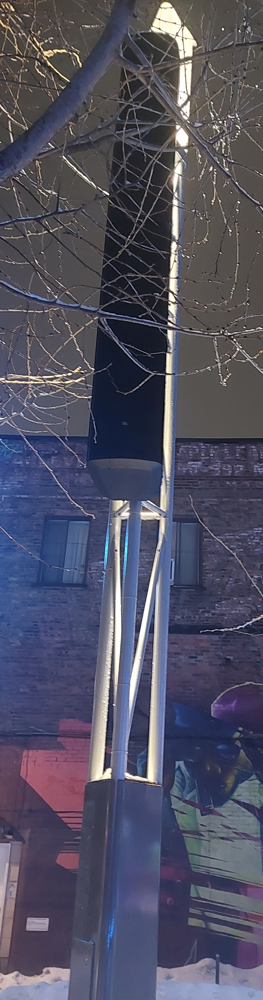

# <ins>Au Bord du Lac Tranquille</ins>

## Patinoire de l'Esplanade Tranquille
Exposition extérieur et temporaire visitée le 4 Mars 2025 (exposé du 28 novembre 2024 au 9 mars 2025) par Alexis Guilbault et Félix Guilbault.
Créé par Lumino en 2021 (exposé en Décembre 2022 pour la première fois)

*Image prise devant la patinoire de l'Esplanade Tranquille*

*Image prise dans ma chambre, mais j'avais pas de meilleure photo de mon partenaire Félix Guilbault, patinologue à l'université de Saint-Roch-De-L'Achigan (alias mon petit frère)*
[(p.s. cette image sert uniquement pour le support visuel lors de la présentation)] : #

## Description de l'oeuvre interactive

Une projection peut être vu sur une moitié de la patinoire montrant différentes espèces marines telles que des poissons, des baleines ou des tortues. Lorsque les utilisateurs patinent, les espèces marines vont dynamiquement réagir aux utilisateurs et se repositionner en accord. Il y a aussi de la musique de fond pour mieux immerser les utilisateurs. Le but de cette oeuvre est de premièrement expérimenter avec l'interactivité sur une patinoire extérieure, et deuxièmement de célébrer la biodiversité marine.

*Image de l'oeuvre (point de vue d'un observateur)*

*Vidéo de l'oeuvre*

L'oeuvre occupe la moitié de la patinoire.

## Matériel de l'oeuvre
L'oeuvre contient les composantes suivantes : 
- La patinoire

  Il s'agit du canva par lequel la projection est faites
  
- Des projecteurs 4K

  Permettent de projeter les images en hautes-qualités
  
  
  *Image des projecteurs*

- Des hauts-parleurs

  Permettent de jouer une musique relaxante au fil de l'oeuvre
  

  *Image des hauts-parleurs*

- Des lidars (capteurs lasers)

  Permettent de scanner les mouvements des utilisateurs
  

  *Images de lidars*

- Serveurs

  Permettent de gérer l'interactivité de l'oeuvre en repositionnant les animaux aquatiques en temps réel

## Appréciation et expérience vécue autour de l'oeuvre
L'expérience vécu était particulièrement mauvaise pour mon cas. Mon grand frère avait oublié qu'on devait aller visiter l'oeuvre la journée même, donc il y a eu du niaisage là-dessus, ça a mené à ce qu'on arrive en retard pour la première diffusion de l'oeuvre du jour donc nous sommes allés au complexe desjardins attendre un heure entière pour la deuxième et dernière diffusion. Lorsque nous y sommes enfin arrivés, nous avions chercher pendant quelques minutes où la diffusion se trouvait. (nous pensions que la projection était sur la patinoire entière) Mes 2 frères essayaient de me convaincre de partir le plus vite possible tout au long de notre observation. Nous y sommes donc restés seulement 5 minutes pour 2+ heures de transport et d'attente. Par ma glacophobie, je n'ai pas pu patiner sur la glace non plus donc c'était purement de l'observation.

Ce qu'il m'a plu, c'est l'esthétique de la projection. Elle est vraiemnt très belle et parfois elle à l'air quasiment surréel. De plus, le bleu et le noir sont deux couleurs (le noir est pas une couleur, mais ignorons) qui se mélangent très bien à mon avis et le résultat final est presque toujours beau. Cette projection n'y fait pas exception.

Ce qu'il m'a déplu, c'est l'horaire de diffusion de l'oeuvre. Il est évident que, pour une projection extérieur, l'horaire doit être flexible, mais j'ai l'impression que, vu que l'espace prend la moitié de la patinoire, laisser l'oeuvre rouler du coucher du soleil à genre minuit (comme c'était le cas les années précédentes de ce que j'ai vu), aurait été surement plus plaisant et n'aurait pas forcément déranger les spectateurs vu que, comme dit à maintes reprises, elle ne prend que la moitié de la patinoire, donc ceux qui ne veulent pas y rester sont libres d'aller sur la deuxième moitié sans projection de la patinoire.

[(Source des images libéllés ¹) Site de l'oeuvre](https://www.googleadservices.com/pagead/aclk?sa=L&ai=DChcSEwjh9Obn97KLAxUeYEcBHWRxJY8YABAAGgJxdQ&ae=2&co=1&gclid=Cj0KCQiA-5a9BhCBARIsACwMkJ5rxFipudPAHi6vbXw86fXZqV2oRTKTk2Y35XHmwokjbj_MCgWfaZoaAh9nEALw_wcB&ohost=www.google.com&cid=CAESVeD2tSrNBVqXaHkhqeAYf17MEwNoTn43T5s2TFoSW-VXp7-nQVjNwLz71bnglRcXEyN6UiLCSbWEjsnFnQuhRMdi3fXitaW4F-dUEspeqB6gXsjACDM&sig=AOD64_2Azj-R_gqfCaLjsnC907iS5beE3A&q&adurl&ved=2ahUKEwinr-Dn97KLAxXHEFkFHbmyIYkQ0Qx6BAgWEAQ)
[(Source des images libéllés ²) Vidéo «making-of» de l'oeuvre](https://www.youtube.com/watch?v=xB-7hQD6Qww)
