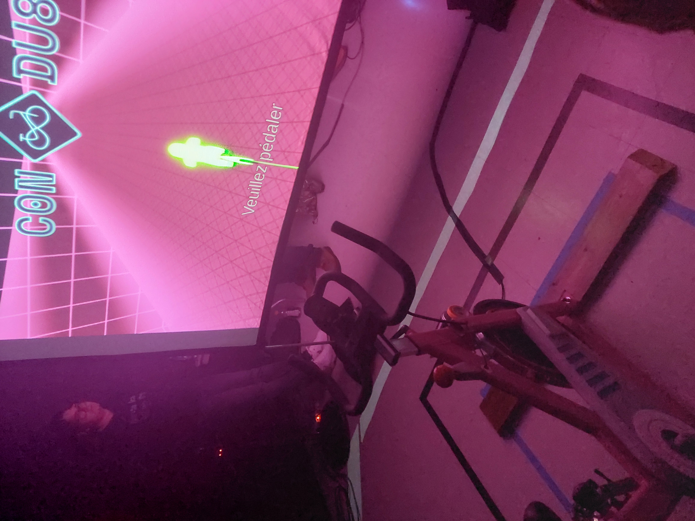
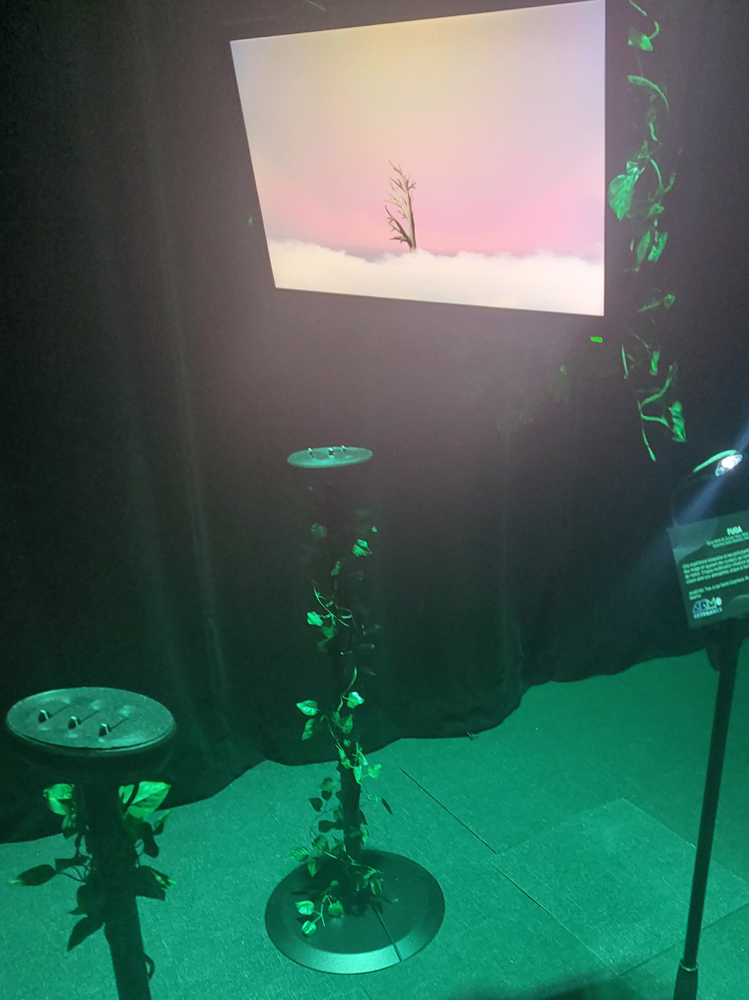
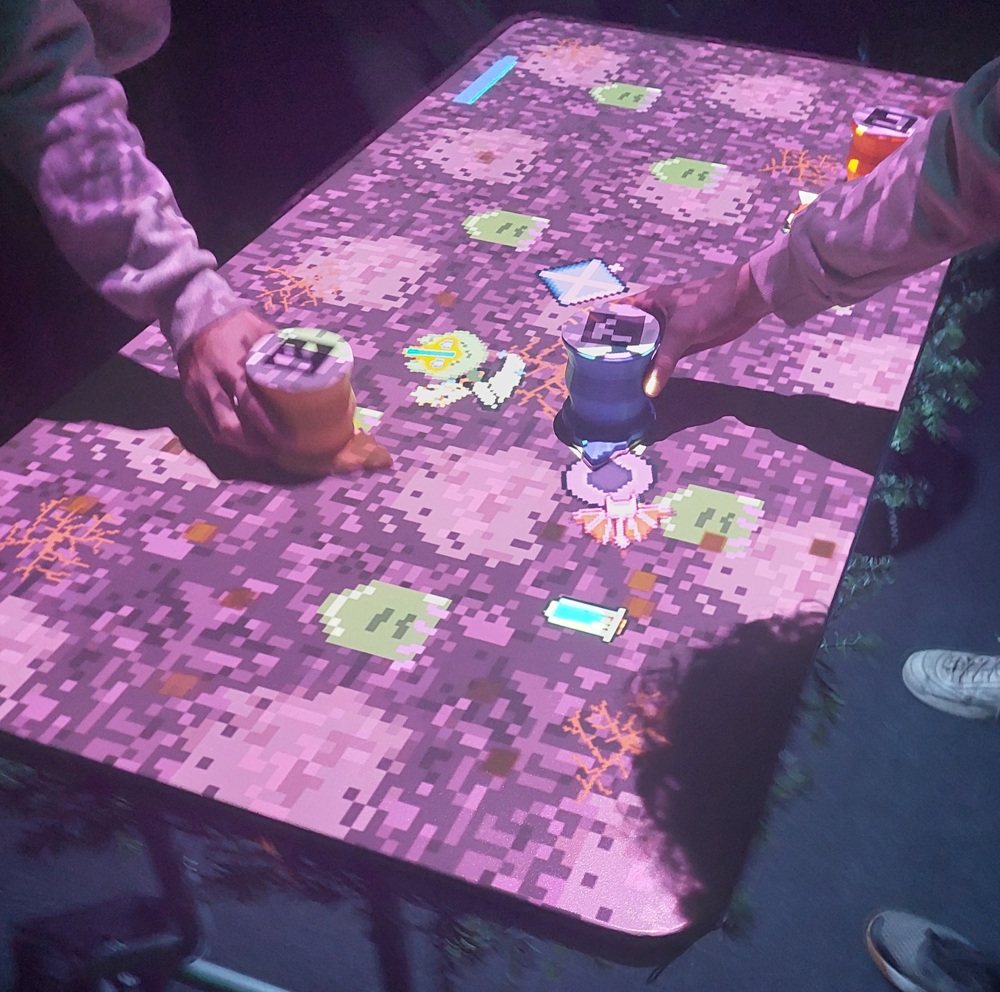
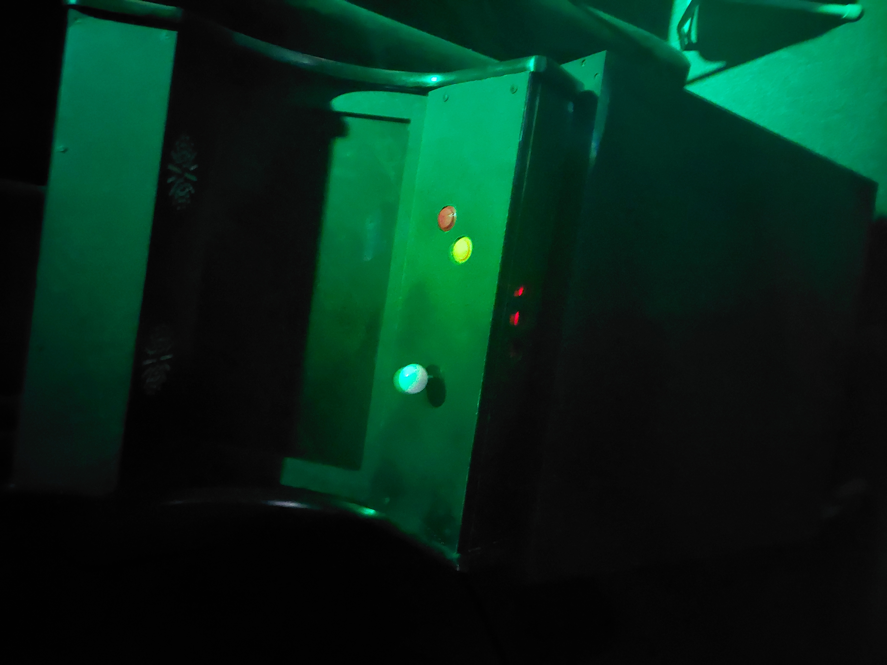
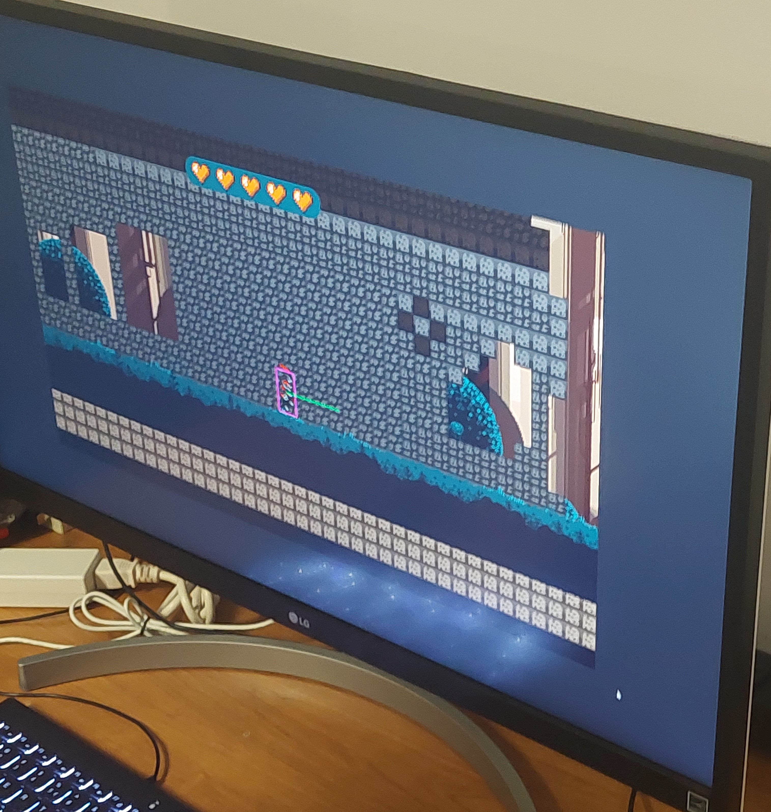

[Du second meilleur à celui que j'ai le moins apprécié, excepté Arcadia qui est dernier puisque je n'ai pas pu l'expérimenter.]: #
# Fiche C0N DU8
exposition créée par : 
- Ian Corbin, Concepteur de niveau
- Samuel Desmeules Voyer, Directeur artistique
- Alexandre Gervais, Programmeur des méchanismes du jeu
- Kevin Malric, Responsable du développement technique
- Jérémy Roy Coté, Programmeur de l'interconnectivité

*Aperçu de l'installation*

*Schéma de l'installation*

L'oeuvre était très amusante et le mélange de ludicité et de cardio est vraiment bien fait. L'esthétique est très belle et les techniques sont très impressionantes.

# Fiche FUGA
exposition créée par : 
- Matis Labelle, chargé de projet
- Tristan Khadka, Directeur Sonore
- Daniel Dezemma, Directeur Visuel
- Abdel Ali Djeral, Programmeur
- Yavuz-Selim Gucluer, programmeur

*Aperçu de l'installation*

*Schéma de l'installation*

J'ai été surpris du résultat final de cette oeuvre. Lors de la visite de la maquette, c'est celle qui m'avait le moins marqué. Je suis heureux de dire que j'ai été corrigé, le résultat final est vraiment très beau et j'adore le concept du projet.

# Fiche Prismatica
exposition créée par : 
- Vincent Delisle, Développeur et concepteur sonore
- Ikrame Rata, Chef de projet
- Jérémy Duverseau, Directeur artistique

*Aperçu de l'installation*

*Schéma de l'installation*

L'installation était bien, mais pas mémorable et sa disposition aurait pu être meilleure.

# Fiche Etheria
exposition créée par : 
- Joshua Gonzalez Barrera, Artiste design, programmeur
- Victor Gileau, Programmeur, Artiste Design
- Michael Un Dupré, programmeur et artiste design/vfx
- Pierre-Luc Proulx, Programmeur, artiste vfx, artiste 3D
- Maik Hamel, Concepteur sonore et programmeur

*Aperçu de l'installation*

*Schéma de l'installation*

J'aime bien le concept de l'oeuvre, mais je n'ai pas été particulièrement surpris par l'oeuvre. Je le vois plus comme juste un autre projet, c'est dans ceux qui m'ont le moins marqué.

# Fiche Internature
exposition créée par : 
- Khaly Tia Sing
- Isaac Fafard
- Delphine Grenier
- Sitmonternna Yi
- Kenza El Harrif

*Aperçu de l'installation*

*Schéma de l'installation*

L'oeuvre était très belle, mais j'ai l'impression qu'il manquait quelque chose. L'oeuvre semble un petit peu vide.

# Fiche Arcadia
exposition créée par : 
- Dominic Yale, concepteur sonore
- William Beauvais, conception visuelle
- Anton Nikulin, programmation

*Aperçu de l'installation*

*Aperçu du jeu*

(pas de schéma trouvé pour cette installation)

L'oeuvre n'était pas utilisable lors de ma visite, cependant j'ai aimé l'intention du projet et l'installation finale.

# Cours de la technique nécessaire pour faire ses projets
1- Programmation interactive
Évidemment, tous les projets rencontrent une forme de programmation à un moment où un autre. De ce fait, je pense qu'il est nécessaire d'avoir le cours d'introduction à la dites programmation.

2- Objets interactifs
Ce cours est, selon moi, essentiel pour les installations des finissants. Ils ont tous à un moment où un autre des objets interactifs (capteurs, velos, etc.) je pense donc que ce cours est important pour les projets.

3- Conception d'un projet multimédia
Ce cours présente la conception et gestion d'un projet multimedia. Évidemment, une grande partie de la création d'un projet est sa gestion. Voici pourquoi je trouve ce cours pertinent pour les projets des finissants.

# Technique Mystère
Pour C0N DU8, la traduction du pédalement de vélo (et la vitesse) en mouvement d'avatar sur le jeu.

Pour faire cela, les développeurs du projet ont installés un voltmètre sur la roue du vélo. L'énergie motrice générée par la roue du vélo est enregistrée dans l'ordinateur et, plus il y a de volts, plus l'avatar avance rapidement. Il y a aussi une camera utilisée pour regarder si l'utilisateur penche à gauche ou à droite, permettant de faire tourner l'avatar dans ses directions.
