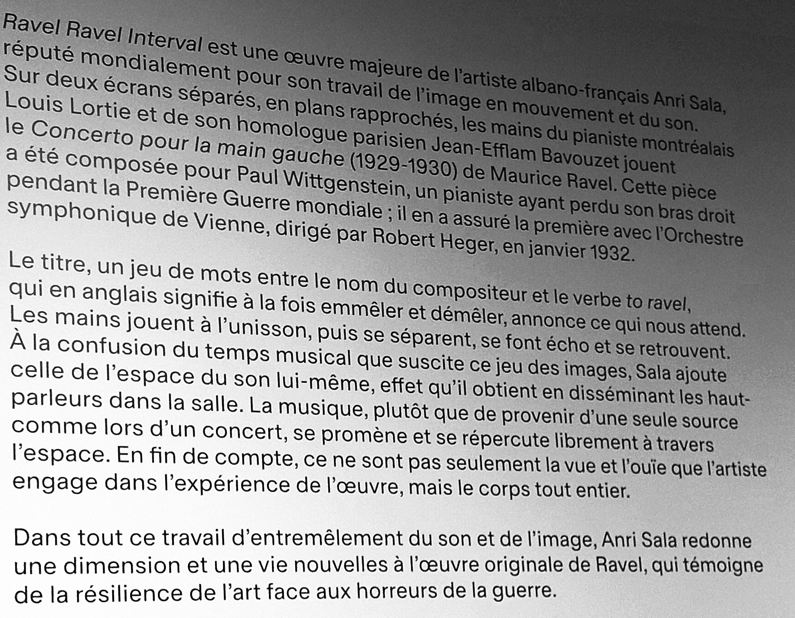
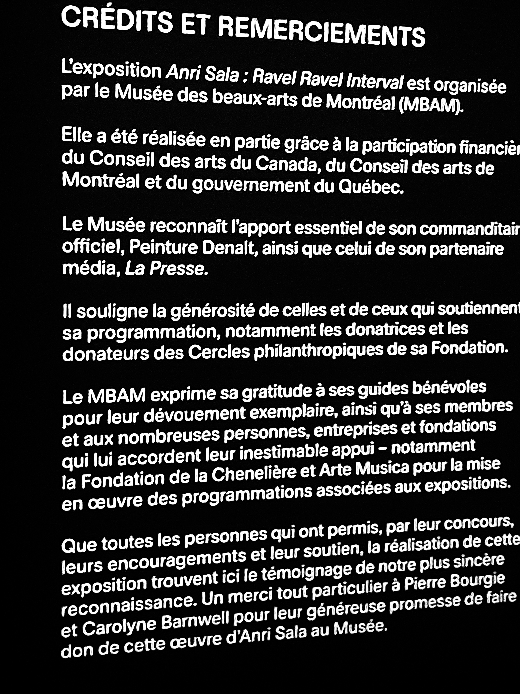
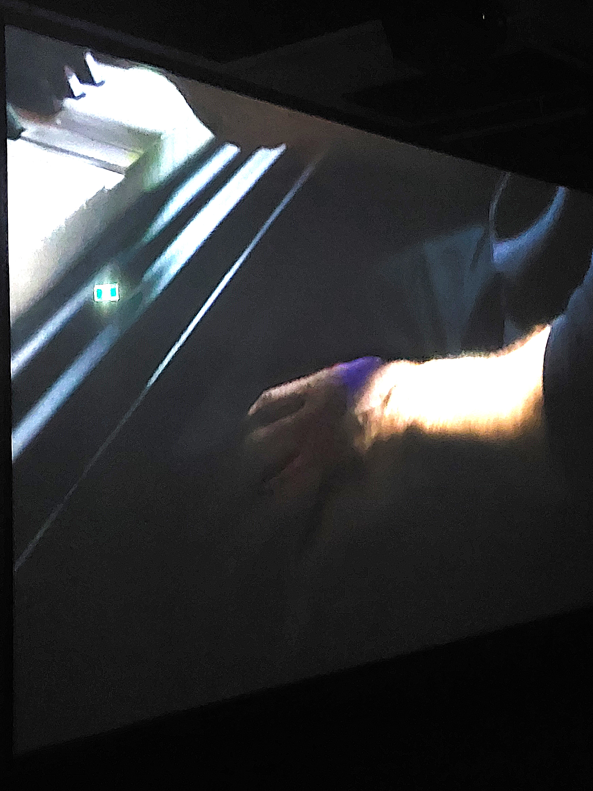
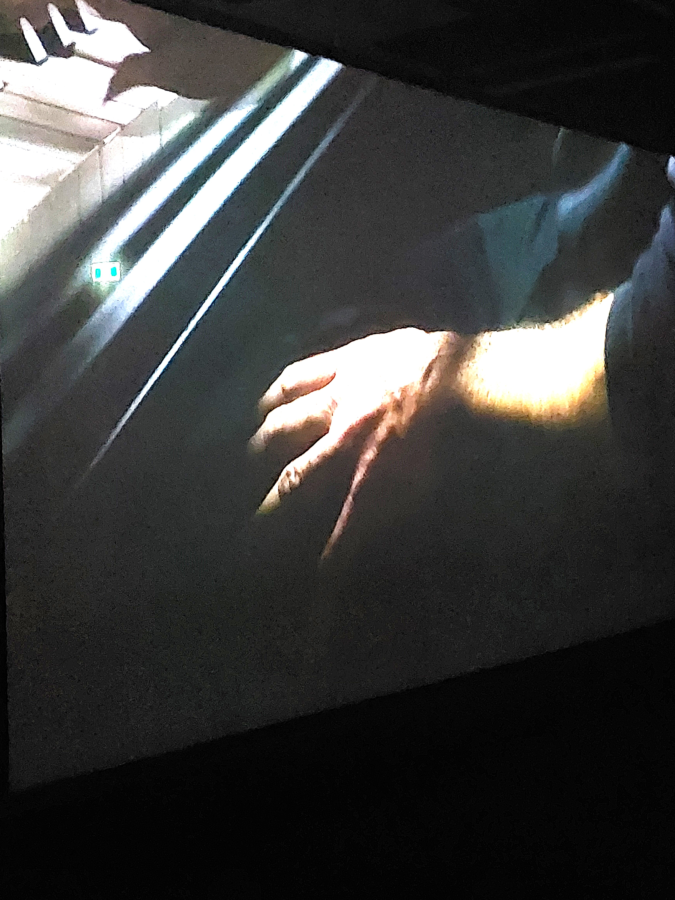
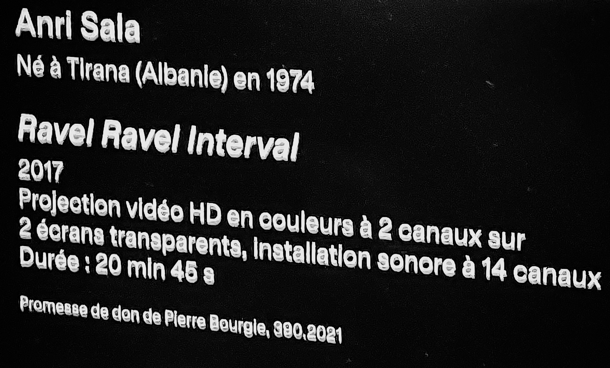

# <ins>Ravel Ravel Interval</ins>

## Musée des Beaux Arts de Montréal

Exposition intérieure et temporaire visitée le 3 mars 2025.

*Description de l'œuvre*

Œuvre créé par Anri Sala en 2017.

*Crédits de l'oeuvre*

L'utilisateur entre dans la pièce devant 2 écrans parrallèles. À sa gauche il peut aller s'asseoir à un banc où les 2 écrans semi-transparentes se superposent. Les vidéos montrent deux présentation quasi-identiques d'une main jouant du piano. La vidéo dure 20 minutes et 45 secondes et elle joue en boucle. L'utilisateur est libre de venir et quitter quand il veut durant la vidéo.

*Image de l'oeuvre durant la vidéo*

L'œuvre est contemplative.

*Image d'ensemble de l'oeuvre*

L'œuvre se trouve dans une grande pièce isolée. Au-dessus se trouvent tous les hauts-parleurs, au fond à droite se trouve les bancs pour contemplr l'art. On peut très facilement voir les 14 hauts-parleurs et les 2 écrans, révélant directement la mise en scène de l'oeuvre.

## Matériel du dispositif

*Image des deux écrans parrallèles*

L'œuvre fonctionne grâce aux composantes suivantes : 
- 2 écrans semi-transparents haute-définition (avec des canaux différents)
- 14 hauts-parleurs (avec des canaux différents)

*Autre image de l'oeuvre durant la vidéo*

## Appréciation du dispositif
Le dispositif a été d'abord enrageant. Je n'avais pas lu au préalable la description du dispositif (comme le public ciblé, beaucoup plus jeune, aurait sûrement fait), je n'avais donc pas réalisé l'intérêt du dispositif ni la volonté derrière le décalage entre les mouvement de l'utilisateur et de la silhouette. L'enragement a fait place à une satisfaction lorsque j'ai réalisé l'intérêt du décalage en question.

Ce qu'il m'a plu, voire inspiré, de ce dispositif est la manière dont il intègre l'anatomie humaine dans son jeu pour un apprentissage efficace. Dans ce cas, il utilise le décalage entre le cerveau et les muscles d'un enfant montré par le fameux décalage entre les mouvements de l'utilisateur et ceux de son avatar. Ceci me fait penser du potentiel d'utiliser une partie de l'anatomie humaine, ou la psychologie, pour immerser un joueur dans un jeu vidéo ou une installation interactive, entre autres.

Ce qu'il m'a déplu (et que j'aurais voulu améliorer) est l'esthétique de l'installation. Je comprend parfaitement qu'il ne s'agit qu'un dispositif sur plusieurs. Cependant, je trouve que l'image est... très vide pour un dispositif ciblé à un public plus jeune. J'aurais mis plus d'éléments de fond et plus coloré, en m'assurant de ne pas enlever d'attention sur le but ou le ballon. Ceci permettrait sûrement aux enfants d'être plus attirés vers l'attraction et de la conserver en mémoire plus longtemps, amplifiant la diffusion du message du dispositif.

*Cartel de l'oeuvre*
