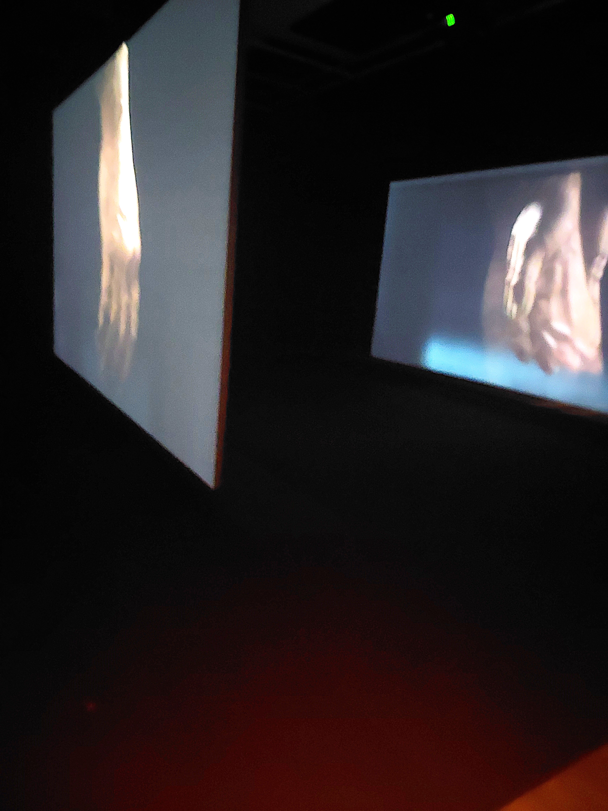

# <ins>Ravel Ravel Interval</ins>

## Musée des Beaux Arts de Montréal

Exposition intérieure et temporaire visitée le 3 mars 2025.

*Description de l'œuvre*

Œuvre créé par Anri Sala en 2017.

*Crédits de l'oeuvre*

L'utilisateur entre dans la pièce devant 2 écrans parrallèles. À sa gauche il peut aller s'asseoir à un banc où les 2 écrans semi-transparentes se superposent. Les vidéos montrent deux présentation quasi-identiques d'une main jouant du piano. La vidéo dure 20 minutes et 45 secondes et elle joue en boucle. L'utilisateur est libre de venir et quitter quand il veut durant la vidéo.

*Image de l'oeuvre durant la vidéo*

L'œuvre est contemplative.

*Image d'ensemble de l'oeuvre*

L'œuvre se trouve dans une grande pièce isolée. Au-dessus se trouvent tous les hauts-parleurs, au fond à droite se trouve les bancs pour contemplr l'art. On peut très facilement voir les 14 hauts-parleurs et les 2 écrans, révélant directement la mise en scène de l'oeuvre.

## Matériel du dispositif

*Image des deux écrans parrallèles*

L'œuvre fonctionne grâce aux composantes suivantes : 
- 2 écrans semi-transparents haute-définition (avec des canaux différents)
- 14 hauts-parleurs (avec des canaux différents)

*Autre image de l'oeuvre durant la vidéo*

## Appréciation du dispositif
L'œuvre est un petit peu ennuyante, dans le sens où il n'y a pas grand chose à faire à part regarder. Évidemment il s'agit du principe d'un musée, cependant l'œuvre ne montre qu'un homme jouant du piano avec un petit revirement à la fin, mais il ne compense pas le fait que la vidéo dure 20 minutes, ce qui est infuriant lorsque tu dois la regarder en son entièreté.

Ce qu'il m'a impressionné, c'est que l'œuvre contient 14 canaux sonores et la musique est très bonne. La tonalité était très bien présente toute au long de l'œuvre.

Ce qu'il m'a déplu c'est, en fait, même pas en rapport à l'œuvre, mais par rapport au contexte de la visite de l'œuvre. Lors de la visite du musée, cette œuvre (que j'ai dû regarder en entier malgré le fait qu'elle est très redondante) et une seule autre œuvre ont été visités, ne compensant pas tant le transport ou la préparation pour la visite du musée.

*Cartel de l'oeuvre*

Toutes les images ont été prises par moi.

Note : À cause de la luminosité faible, plusieurs photos ont finis très flous ou de mauvaise qualité, oops.
